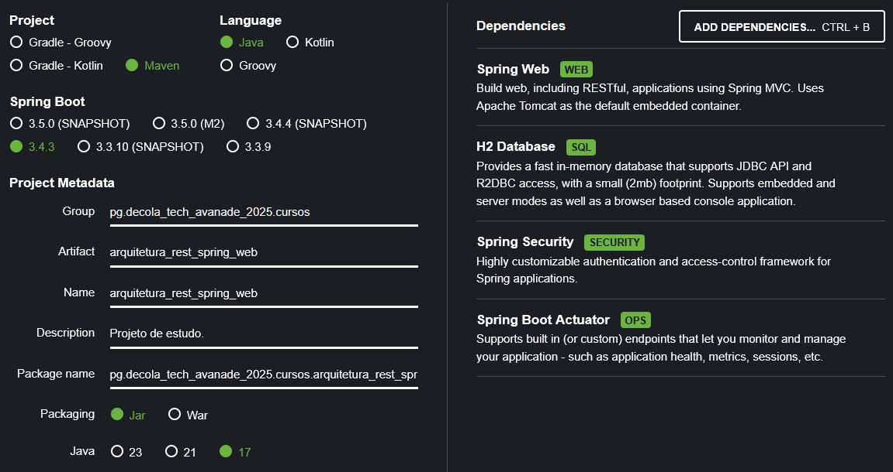

# Projeto de estudo, seguindo o conteúdo apresentado no curso 'Arquitetura de Aplicações Rest com Spring Web'
O repositório contém, além das anotações nesse documento, um projeto Spring Boot desenvolvido seguindo o conteúdo apresentado na aula.
Caso haja divergência deixo claro, em comentários no código, o porquê de ter divergido da implementação demonstrada no curso.

## Setup
### Estrutura do projeto + dependências iniciais
O projeto foi estruturado da com ajuda da ferramenta [Spring Initializr](start.spring.io), incluindo algumas dependências que—acredito—serão necessárias no curso.



### Faltaram algumas dependências...
- Spring Data JPA, sem ela não tenho como interagir com banco de dados. O starter da dependência, incluído no pom.xml, é:
    ```
    <dependency>
        <groupId>org.springframework.boot</groupId>
        <artifactId>spring-boot-starter-data-jpa</artifactId>
        <version>3.4.3</version>
    </dependency>
    ```

### Configuração adicional
- Configuração do banco de dados in-memory h2 para testes; Adicionada ao arquivo resources/application.properties.
  ```
  spring.application.name=arquitetura_rest_spring_web
  
  spring.datasource.url=jdbc:h2:mem:testdb
  spring.datasource.driverClassName=org.h2.Driver
  spring.datasource.username=sa
  spring.datasource.password=password
  spring.jpa.database-platform=org.hibernate.dialect.H2Dialect
  ```
- Configuração inicial do Spring Security pra facilitar testes; Adicionada ao arquivo resources/application.properties.
  ```
  # Defino usuário e senha padrão pra evitar de ter que usar a senha gerada no startup da aplicação.
  spring.security.user.name=user
  spring.security.user.password=password
  ```

## Padões, Conceitos Aplicados e Definições

### REST (REpresentational State Transfer)
- Padrão arquitetural que visa facilitar a comunicação entre aplicações;
- Suporta diferentes formatos para transferência de dados; Entre eles JSON, XML, Plain Text;
- Define uma interface interface comum para interação com API via HTTP, fazendo uso dos verbos HTTP (POST, GET, etc.) em conjunto com separação dos recursos (como em: GET url.com/recurso);
- RESTful: Sistema que implementa padrão arquitetural REST;

### Exception Handling no Spring
- Annotation `@ControllerAdvice`: Permite definir uma classe responsável por tratativa de excessões globalmente dentro da aplicação.
  - Classes de `@ControllerAdvice` devem herdar de `ResponseEntityExceptionHandler`.
- Annotation `@ExceptionHandler`: Permite, dentro de uma classe decorada com `@ControllerAdvice`, indicar métodos responsáveis por lidar com excessões específicas e retornar respostas de acordo.
  - Métodos de `@ExceptionHandler` devem especificar uma ou mais Exceptions às quais devem responder; Feito da seguinte maneira: `@ExceptionHandler(Exception.class)` ou `@ExceptionHandler({ExceptionClassA.class, ExceptionClassB.class})`.
## Referências
- [Martin Fowler - Richardson Maturity Model: Steps toward the glory of REST](https://martinfowler.com/articles/richardsonMaturityModel.html)
- [Beldung - Spring Boot With H2 Database](https://www.baeldung.com/spring-boot-h2-database)